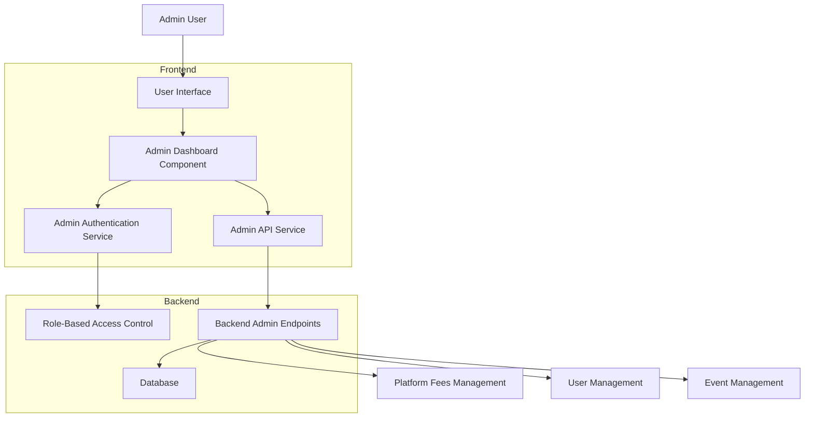

# Admin Dashboard Implementation Plan

## Overview
This document outlines the implementation plan for creating an admin dashboard that allows management of users, events, and platform fees through a user-friendly UI with role-based access control.

## Architecture Diagram



## Component Structure

### 1. Admin Dashboard Component Structure
```
src/
├── components/
│   └── admin/
│       ├── AdminDashboard.jsx
│       ├── PlatformFeesManagement.jsx
│       ├── UserManagement.jsx
│       ├── EventManagement.jsx
│       └── AdminNavigation.jsx
├── services/
│   └── adminApi.js
└── hooks/
    └── useAdminAuth.js
```

## Implementation Details

### 1. Admin Authentication System with Role-Based Access
- Create a new `is_admin` field in the users table
- Implement role-based access control in frontend and backend
- Add admin check to user profile endpoint
- Create admin authentication hook

### 2. Admin API Service for Backend Communication
- Create service to handle all admin API calls
- Implement proper error handling and loading states
- Add authentication headers for admin requests
- Create reusable functions for common admin operations

### 3. Platform Fees Management Section
- Display total platform fees collected
- Show fee transfer history with details (date, amount, recipient, reason)
- Implement transfer fees to users functionality with validation
- Add audit log display for fee transactions
- Configure fee distribution rules (percentage, minimum amounts, etc.)
- Generate reports on fee collection and distribution

### 4. User Management Section
- Display list of all users with pagination and filtering
- Show user details (points, participation history, win/loss record, last login)
- Implement user search and filtering by username, email, or activity
- Add user actions:
  - Adjust points with reason and audit logging
  - View detailed participation history and analytics
  - Reset user claims to allow immediate point claiming
  - Manage user roles (admin/non-admin)
  - Suspend/unsuspend accounts
  - View user audit trail
- Display user statistics and platform engagement metrics
- Implement bulk actions for multiple users

### 5. Event Management Section
- Display all events (active, pending, resolved) with filtering options
- Show event details and statistics (participants, prize pool, fees collected)
- Implement event creation functionality with all parameters:
  - Title, description, entry fee, start/end times
  - Prediction options and cryptocurrency settings
  - Participant limits and event categories
- Add event resolution tools for manual resolution
- Display event performance metrics and analytics
- Manage event templates for quick creation
- Implement event modification capabilities:
  - Update event details for future events
  - Suspend/unsuspend events
  - Extend event duration
- Add bulk operations for multiple events
- Implement event deletion for future events only
- Show participant lists and bet details
- Generate event reports and statistics

### 6. Admin Navigation Integration
- Add admin options to user profile dropdown menu
- Show "Admin Dashboard" link only for users with admin privileges
- Create admin-specific navigation menu with sections
- Implement proper routing for admin sections
- Add quick access to common admin functions
- Show admin notifications and alerts

### 7. Admin Route Protection
- Create protected routes that check admin status
- Implement redirect for non-admin users
- Add loading states during authentication checks
- Show appropriate error messages for unauthorized access

## Backend Requirements

### Database Changes
- Add `is_admin` boolean field to users table with default false
- Add `is_suspended` boolean field to users table with default false
- Ensure existing admin endpoints work with new authentication
- Add tables for fee distribution rules if needed
- Add tables for event templates
- Add indexes for improved admin query performance

### API Endpoints Needed
- `GET /api/admin/users` - Get all users with pagination and filtering
- `GET /api/admin/users/:id` - Get specific user details and history
- `PUT /api/admin/users/:id/points` - Adjust user points with reason
- `PUT /api/admin/users/:id/role` - Update user admin role
- `PUT /api/admin/users/:id/suspend` - Suspend/unsuspend user account
- `POST /api/admin/users/:id/reset-claims` - Reset user claim timer
- `GET /api/admin/events` - Get all events with filtering options
- `POST /api/admin/events` - Create new event with full parameters
- `POST /api/admin/events/:id/resolve` - Manually resolve event
- `PUT /api/admin/events/:id` - Update event details
- `DELETE /api/admin/events/:id` - Delete event (future events only)
- `POST /api/admin/events/:id/suspend` - Suspend/unsuspend event
- `GET /api/admin/events/:id/participants` - Get event participants
- `GET /api/admin/event-templates` - Get event templates
- `POST /api/admin/event-templates` - Create event template
- `PUT /api/admin/event-templates/:id` - Update event template
- `DELETE /api/admin/event-templates/:id` - Delete event template
- `GET /api/admin/platform-fees/history` - Get fee transfer history
- `GET /api/admin/platform-fees/rules` - Get fee distribution rules
- `PUT /api/admin/platform-fees/rules` - Update fee distribution rules
- `GET /api/admin/analytics` - Get platform analytics data
- `GET /api/admin/audit-logs` - Get system audit logs

## Security Considerations
- All admin endpoints must be protected with admin authentication
- Implement proper role checking on both frontend and backend
- Add rate limiting for admin operations to prevent abuse
- Log all admin actions for audit purposes with timestamps and reasons
- Implement CSRF protection for state-changing admin operations
- Validate all inputs on admin forms to prevent injection attacks
- Implement proper session management for admin users
- Add IP whitelisting options for admin access (optional)
- Implement data validation for event creation/modification

## Testing Plan
1. Test admin authentication flow and role-based access
2. Verify role-based access control prevents unauthorized access
3. Test all admin CRUD operations with valid and invalid data
4. Verify proper error handling and user feedback
5. Test responsive design on all admin components
6. Test performance with large datasets
7. Verify audit logging captures all admin actions
8. Test edge cases and error recovery scenarios
9. Test concurrent admin operations
10. Verify data integrity during bulk operations
11. Test event creation with various parameters
12. Test event resolution and participant management

## Deployment Considerations
- Ensure environment variables are properly configured for admin features
- Verify admin API endpoints are properly secured in production
- Test performance with large datasets and concurrent admin users
- Ensure backup and recovery procedures include admin data
- Document admin procedures for operational staff
- Implement monitoring for admin activity
- Ensure event templates are properly migrated

## User Experience Considerations
- Implement loading states for all async admin operations
- Provide clear feedback for all user actions
- Add confirmation dialogs for destructive operations
- Implement search and filtering to handle large datasets
- Add keyboard navigation support for power users
- Ensure accessibility compliance for admin interfaces
- Add tooltips and help text for complex admin functions
- Implement data export capabilities for reports
- Add dashboard widgets for key metrics
- Implement user activity notifications
- Add event preview functionality
- Implement template-based event creation