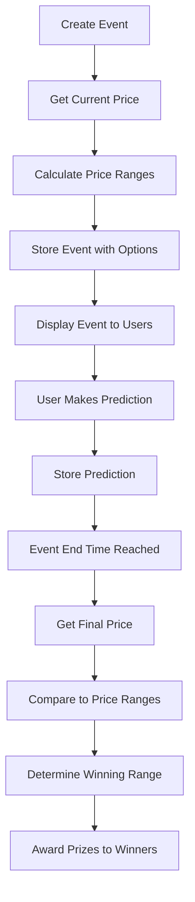

# Enhanced Bitcoin Price Prediction Events

## Overview
This document describes the implementation of enhanced Bitcoin price prediction events with multiple price range options instead of the simple "Higher/Lower" prediction. This provides users with more granular prediction options, increasing engagement and making the predictions more interesting.

## Current Implementation
The updated system creates prediction events with six price range options:
- Users predict which price range the Bitcoin price will close in at the end of the day
- The six options are:
  1. "0-3% up" - price increases between 0% and 3%
  2. "3-5% up" - price increases between 3% and 5%
  3. "5%+ up" - price increases by 5% or more
  4. "0-3% down" - price decreases between 0% and 3%
  5. "3-5% down" - price decreases between 3% and 5%
  6. "5%+ down" - price decreases by 5% or more
- A single entry fee is used for all predictions
- The event resolution compares the final price to the initial price to determine winners

## Technical Design

### 1. Event Creation Logic
When creating a new event, the system:
1. Get the current Bitcoin price from CoinGecko
2. Calculate the price range boundaries based on the initial price
3. Store the options in the event's options field as JSON
4. Create the event with the new price range options
5. Uses a new title format "How will Bitcoin close on {date}?"

### 2. Price Range Calculation
For a given initial price, the ranges are calculated as:
```javascript
const calculatePriceRanges = (initialPrice) => {
  const percent3 = initialPrice * 0.03;
  const percent5 = initialPrice * 0.05;
  
  return {
    "0-3% up": {
      min: initialPrice,
      max: initialPrice + percent3
    },
    "3-5% up": {
      min: initialPrice + percent3,
      max: initialPrice + percent5
    },
    "5%+ up": {
      min: initialPrice + percent5,
      max: null  // No upper limit
    },
    "0-3% down": {
      min: initialPrice - percent3,
      max: initialPrice
    },
    "3-5% down": {
      min: initialPrice - percent5,
      max: initialPrice - percent3
    },
    "5%+ down": {
      min: null,  // No lower limit
      max: initialPrice - percent5
    }
  };
};
```

The six options are:
1. "0-3% up" - price between initial price and initial price + 3%
2. "3-5% up" - price between initial price + 3% and initial price + 5%
3. "5%+ up" - price above initial price + 5%
4. "0-3% down" - price between initial price - 3% and initial price
5. "3-5% down" - price between initial price - 5% and initial price - 3%
6. "5%+ down" - price below initial price - 5%

### 3. Event Resolution Logic
When resolving an event, the system:
1. Get the final Bitcoin price from CoinGecko
2. Compare the final price to the initial price and boundaries
3. Determine which range the final price falls into using the `determinePriceRange` function
4. Set the correct_answer field in the event
5. Award prizes to participants who predicted that range

### 4. Database Changes
No schema changes were required since:
- The existing `options` field in the `events` table is already TEXT type which can store JSON
- The existing `prediction` field in the `participants` table is already TEXT type which can store the new prediction options
- The existing `correct_answer` field in the `events` table can store the correct range
- The existing event structure supports this enhancement without modifications

### 5. Frontend Changes
The frontend components were updated to:
1. Display the new price range options instead of "Higher/Lower"
2. Allow users to select from the 6 price range options
3. Show the price range boundaries for each option
4. Update the event display to show the new options

## Implementation Details

### Backend Implementation
1. Added helper functions to calculate price ranges and determine final price ranges in coingecko.js
2. Updated the event creation function to calculate and store price ranges
3. Updated the event resolution function to use the new price range determination
4. Updated the event creation endpoint to generate the new options
5. Updated the bet placement endpoint to validate the new prediction options
6. Updated the participation endpoint to validate the new prediction options
7. Updated the event details and active events endpoints to include price range information
8. Updated the user history endpoint to properly show results for new event types

### Frontend Implementation
1. Updated EventCard component to display new options
2. Updated EventDetail component to display new options
3. Updated Participation component to allow selection of new options
4. Updated event creation form to remove manual options input
5. Updated all components to handle the new data structure

## Data Flow Diagram


## API Changes
No API changes were required since:
- The existing endpoints can handle the new data structure
- The event creation and resolution logic was updated internally
- The frontend uses the same endpoints with updated data

## Backward Compatibility
The new implementation maintains backward compatibility:
- Existing "Higher/Lower" events will continue to work
- The new price range events use the same database structure
- The resolution logic handles both types of events
- All existing API endpoints continue to function as before