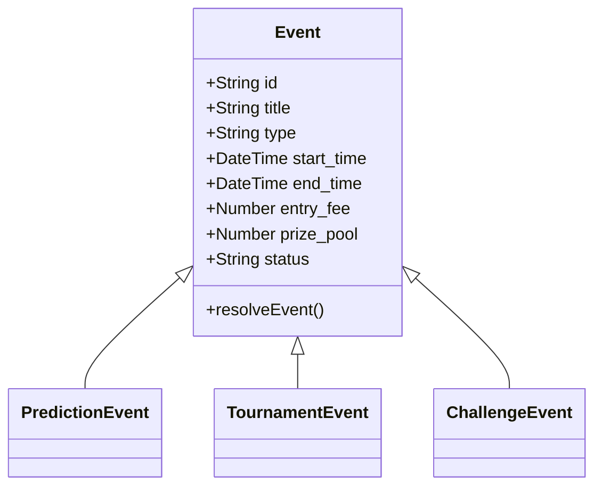
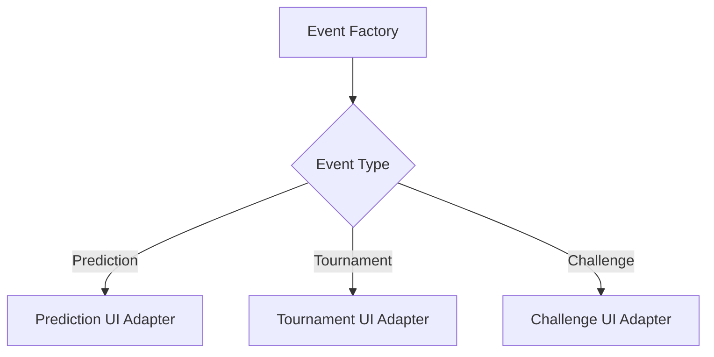
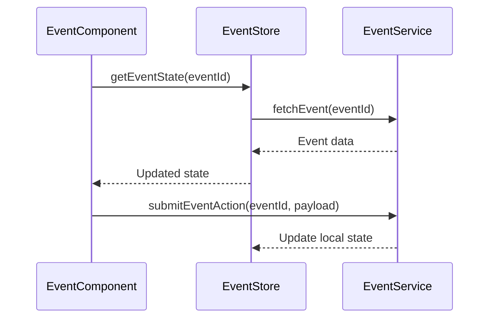

# Event Architecture Decision Record

## 1. Unified Event Model

### Context
The system previously had separate implementations for tournaments and predictions, leading to:
- Code duplication in frontend components
- Inconsistent API endpoints
- Complex state management
- Redundant database schemas

### Decision
Adopt a unified event model that encapsulates:


### Consequences
- **Positive**
  - Single source of truth for event management
  - Simplified component hierarchy ([`frontend/src/components/EventCard.jsx`](../frontend/src/components/EventCard.jsx:12))
  - Consistent API endpoints (`/api/events/*`)
  - Reduced database schema complexity

- **Negative**
  - Migration required for existing tournament data
  - Temporary API versioning during transition

## 2. Frontend Component Unification ([view implementation](../frontend/src/components/EventCard.jsx))

### Context
Multiple component variants existed for similar event types:
- `TournamentCard.jsx`
- `PredictionCard.jsx` 
- `ChallengeCard.jsx`

### Decision
Create a unified `EventCard` component with type-specific adapters:
```javascript
// EventCard.jsx
const EventCard = ({ event }) => {
  const components = {
    prediction: PredictionAdapter,
    tournament: TournamentAdapter,
    challenge: ChallengeAdapter
  };
  
  const TypeSpecificUI = components[event.type];
  
  return (
    <div className="event-card">
      <CommonHeader event={event} />
      <TypeSpecificUI event={event} />
      <CommonFooter event={event} />
    </div>
  );
};
```

### Verification


## 3. API Endpoint Standardization

### Changes
| Old Endpoint                   | New Endpoint               |
|--------------------------------|----------------------------|
| `/api/tournaments/{id}/enter`  | `/api/events/{id}/entries` |
| `/api/predictions/{id}/bet`    | `/api/events/{id}/bets`    |
| `/api/challenges/{id}/join`    | `/api/events/{id}/join`    |

### Migration Strategy
1. Maintain v1 endpoints until 2025-12-01
2. Add v2 endpoints with standardized paths
3. Update client code to use v2 endpoints
4. Monitor usage through API analytics

## 4. State Management

### Architecture


### Data Flow
1. Central event store manages all event states
2. Specialized handlers for event types
3. Real-time updates through WebSocket integration