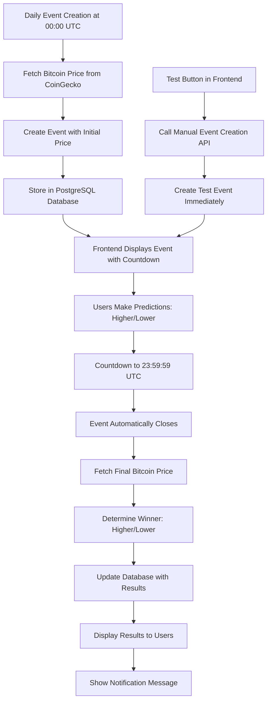

# Event Functionality Documentation

## Overview
This document describes the event functionality implemented in the prediction app. The system automatically creates Bitcoin price prediction events daily, allows users to make predictions, and automatically resolves events after 24 hours.

## System Architecture


## Core Features

### 1. Automatic Event Creation
- **Timing**: Events are created daily at 00:00 UTC
- **Price Source**: Bitcoin price is fetched from CoinGecko API
- **Duration**: 24-hour prediction window (until 23:59:59 UTC)
- **Title Format**: "Bitcoin Price Prediction [Date]"

### 2. Event Resolution
- **Timing**: Events automatically close at 23:59:59 UTC
- **Price Comparison**: Final Bitcoin price is compared with initial price
- **Outcome Determination**:
  - If final price > initial price: "Higher" is the winning prediction
  - If final price < initial price: "Lower" is the winning prediction
- **Winner Reward**: Points are awarded to users who made correct predictions

### 3. Frontend Display
- **Countdown Timer**: Real-time countdown to event closure
- **Price Display**: Shows the initial Bitcoin price at event creation
- **Prediction Options**: "Higher" and "Lower" buttons for user predictions
- **Status Indicators**: Shows event status (active, expired, resolved)

### 4. Test Functionality
- **Test Button**: "Create Test Event" button in the frontend
- **Purpose**: Allows immediate creation of test events without waiting for daily trigger
- **Usage**: For development and testing purposes only
- **API Endpoint**: `POST /api/events/test` (requires admin authentication)

## API Endpoints

### Backend Endpoints
- `GET /api/events/active`: Returns all active events with countdown timer
- `POST /api/events/test`: Creates a test event immediately (admin only)
- `POST /api/events/:id/bet`: Allows users to place predictions on events

### Data Structure
```json
{
  "id": 1,
  "title": "Bitcoin Price Prediction 2025-09-20",
  "description": "Will Bitcoin price be higher or lower than $65,000?",
  "initial_price": 65000,
  "final_price": 67500,
  "correct_answer": "Higher",
  "start_time": "2025-09-20T00:00:00Z",
  "end_time": "2025-09-20T23:59:59Z",
  "status": "resolved",
  "time_remaining": 0,
  "current_participants": 42,
  "prize_pool": 4200
}
```

## Implementation Details

### Backend
- **Event Creation**: Handled by cron job running at 00:00 UTC daily
- **Event Resolution**: Checked every 30 minutes for expired events
- **Database**: PostgreSQL with events table storing all event data
- **Price API**: CoinGecko API for current and historical Bitcoin prices

### Frontend
- **Countdown Timer**: Real-time countdown using React useEffect and setInterval
- **Event Display**: Grid layout showing all active events
- **Prediction Interface**: "Higher" and "Lower" buttons with visual feedback
- **Test Button**: Red button labeled "🧪 Create Test Event" for immediate testing

## Testing and Verification

### Manual Testing Steps
1. Deploy the application to Vercel (frontend) and Render (backend)
2. Click the "Create Test Event" button to create an immediate test event
3. Verify the event appears with:
   - Correct initial Bitcoin price
   - Working countdown timer
   - "Higher" and "Lower" prediction options
4. Make a prediction and verify it's recorded
5. Wait 24 hours or manually trigger resolution to verify automatic closure

### Production Notes
- The "Create Test Event" button should be hidden or removed in production
- Events are automatically created daily at 00:00 UTC
- The system is designed to handle timezone differences (all times in UTC)
- Database backups should be configured to prevent data loss

## Troubleshooting

### Common Issues
- **Event not creating**: Verify cron job is running and CoinGecko API key is valid
- **Countdown not updating**: Check frontend JavaScript console for errors
- **Predictions not saving**: Verify database connection and user authentication
- **Price data missing**: Check CoinGecko API rate limits and network connectivity

### Monitoring
- Check server logs for event creation and resolution messages
- Monitor database for event records and participant data
- Verify frontend console for any JavaScript errors
- Check API response times and error rates

## Future Enhancements
- Add email/SMS notifications for event closure
- Implement leaderboards for top predictors
- Add historical event statistics and charts
- Support multiple cryptocurrencies beyond Bitcoin
- Add social sharing features for events