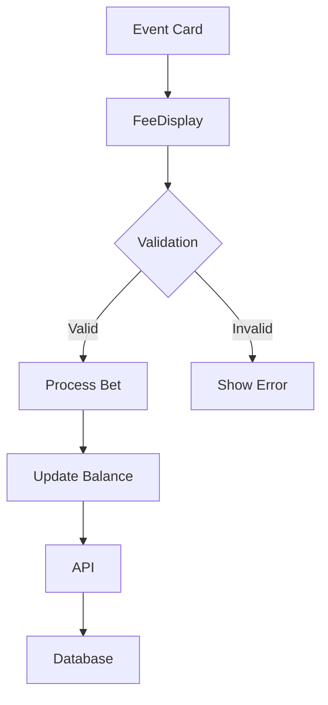

# Event Functionality Documentation

## Overview

This document describes the event functionality implemented in the Polycentral application, which allows users to predict whether the price of Bitcoin will be higher or lower than the current price at a specific time.

## Backend Event System

### Event Creation
Events are automatically created daily at midnight UTC using a cron job. The system uses the CoinGecko API to get the current Bitcoin price and creates an event with this price as the baseline.

```javascript
// server.js
async function createDailyEvent() {
  try {
    console.log('Creating daily Bitcoin prediction event...');
    const currentPrice = await coingecko.getCurrentPrice(process.env.CRYPTO_ID || 'bitcoin');
    await createEvent(currentPrice);
    console.log(`Created new Bitcoin event with initial price: $${currentPrice}`);
  } catch (error) {
    console.error('Error creating daily event:', error);
  }
}

// Cron job runs daily at midnight UTC
cron.schedule('0 0 * * *', createDailyEvent);
```

### Manual Event Creation (Testing)
For development and testing purposes, an admin can manually create an event:

```javascript
// POST /api/events/test
app.post('/api/events/test', authenticateAdmin, async (req, res) => {
  try {
    const price = await coingecko.getCurrentPrice('bitcoin');
    await createEvent(price);
    res.json({ success: true, message: "Test event created successfully" });
  } catch (error) {
    res.status(500).json({ error: 'Failed to create test event' });
  }
});
```

### Event Resolution
Events are automatically resolved after 23:59:59 of their creation day. The system compares the final Bitcoin price with the initial price to determine the outcome.

```javascript
// server.js
async function resolvePendingEvents() {
  try {
    const now = new Date();
    const { rows: events } = await pool.query(
      `SELECT id, end_time, initial_price FROM events
       WHERE end_time < $1 AND resolution_status = 'pending'`,
      [now]
    );

    for (const event of events) {
      try {
        const finalPrice = await coingecko.getHistoricalPrice(process.env.CRYPTO_ID || 'bitcoin', event.end_time);
        
        // Update event with final price
        await pool.query(
          `UPDATE events
           SET final_price = $1, resolution_status = 'resolved'
           WHERE id = $2`,
          [finalPrice, event.id]
        );

        // Determine outcome
        const outcome = finalPrice > event.initial_price ? 'Higher' : 'Lower';
        
        // Award points to winners
        const result = await pool.query(
          `UPDATE users SET points = points + events.entry_fee
           FROM participants
           JOIN events ON participants.event_id = events.id
           WHERE participants.event_id = $1
           AND participants.prediction = $2`,
          [event.id, outcome]
        );
      } catch (error) {
        console.error(`Failed to resolve event ${event.id}:`, error);
      }
    }
  } catch (error) {
    console.error('Error in resolvePendingEvents:', error);
  }
}

// Cron job runs every 30 minutes to check for expired events
cron.schedule('*/30 * * * *', resolvePendingEvents);
```

### API Endpoints

#### GET /api/events/active
Returns all active events with their details and time remaining.

```javascript
app.get('/api/events/active', async (req, res) => {
  try {
    const { rows } = await pool.query(
      `SELECT
        id,
        title,
        description,
        options,
        entry_fee,
        start_time,
        prediction_window AS end_time,
        initial_price,
        final_price,
        correct_answer,
        resolution_status,
        (SELECT COUNT(*) FROM participants WHERE event_id = events.id) AS current_participants,
        (SELECT entry_fee * COUNT(*) FROM participants WHERE event_id = events.id) AS prize_pool
      FROM events
      WHERE status = 'active' OR resolution_status = 'pending'`
    );

    // Calculate time remaining
    const now = new Date();
    const activeEvents = rows.map(event => {
      const endTime = new Date(event.end_time);
      const timeRemaining = Math.floor((endTime - now) / 1000); // seconds
      const isExpired = timeRemaining <= 0;
      
      return {
        ...event,
        end_time: endTime.toISOString(),
        time_remaining: isExpired ? 0 : timeRemaining,
        status: isExpired && event.status === 'active' ? 'expired' : event.status
      };
    });

    res.json(activeEvents);
  } catch (error) {
    res.status(500).json({
      error: 'Internal server error',
      details: error.message
    });
  }
});
```

#### POST /api/events/:id/bet
Allows users to place a bet on an event with "Higher" or "Lower" prediction.

```javascript
app.post('/api/events/:id/bet', authenticateToken, async (req, res) => {
  const eventId = req.params.id;
  const { userId, prediction } = req.body;
  
  // Validate prediction
  if (prediction !== 'Higher' && prediction !== 'Lower') {
    return res.status(400).json({ error: 'Prediction must be "Higher" or "Lower"' });
  }

  const client = await pool.connect();
  try {
    await client.query('BEGIN');

    // Check event exists
    const eventQuery = await client.query('SELECT * FROM events WHERE id = $1', [eventId]);
    if (eventQuery.rows.length === 0) {
      await client.query('ROLLBACK');
      return res.status(404).json({ error: 'Event not found' });
    }
    const event = eventQuery.rows[0];
    
    // Check user has sufficient points
    const userQuery = await client.query('SELECT points FROM users WHERE id = $1', [userId]);
    if (userQuery.rows.length === 0) {
      await client.query('ROLLBACK');
      return res.status(404).json({ error: 'User not found' });
    }
    
    const user = userQuery.rows[0];
    if (user.points < event.entry_fee) {
      await client.query('ROLLBACK');
      return res.status(400).json({ error: 'Insufficient points' });
    }

    // Insert bet into participants table
    const { rows: [newBet] } = await client.query(
        `INSERT INTO participants (event_id, user_id, prediction, amount)
         VALUES ($1, $2, $3, $4)
         RETURNING *`,
        [eventId, userId, prediction, event.entry_fee]
    );

    // Deduct the entry fee from the user's points
    await client.query(
        'UPDATE users SET points = points - $1 WHERE id = $2',
        [event.entry_fee, userId]
    );
    
    await client.query('COMMIT');
    res.status(201).json(newBet);
  } catch (error) {
    await client.query('ROLLBACK');
    res.status(500).json({ error: 'Server error' });
  } finally {
    client.release();
  }
});
```

## Frontend Implementation

### Event Card Component
Displays an event with its details and allows users to place bets.

```jsx
// Event Card Component
const EventCard = ({ event }) => {
  const [timeRemaining, setTimeRemaining] = useState(event.time_remaining);
  const [isExpired, setIsExpired] = useState(timeRemaining <= 0);
  const [betStatus, setBetStatus] = useState(null);

  useEffect(() => {
    if (isExpired) return;
    
    const timer = setInterval(() => {
      setTimeRemaining(prev => {
        if (prev <= 1) {
          clearInterval(timer);
          setIsExpired(true);
          return 0;
        }
        return prev - 1;
      });
    }, 1000);

    return () => clearInterval(timer);
  }, [isExpired]);

  const formatTime = (seconds) => {
    if (seconds <= 0) return 'Expired';
    
    const days = Math.floor(seconds / (3600 * 24));
    const hours = Math.floor((seconds % (3600 * 24)) / 3600);
    const minutes = Math.floor((seconds % 3600) / 60);
    const secs = seconds % 60;
    
    return `${days}d ${hours}h ${minutes}m ${secs}s remaining`;
  };

  const handleBet = async (prediction) => {
    try {
      const token = localStorage.getItem('auth_token');
      if (!token) throw new Error('User not authenticated');
      
      const response = await axios.post(
        `${import.meta.env.VITE_API_BASE_URL}/api/events/${event.id}/bet`,
        { prediction },
        { headers: { Authorization: `Bearer ${token}` } }
      );
      
      setBetStatus('success');
      setTimeout(() => setBetStatus(null), 3000);
    } catch (error) {
      console.error('Betting failed:', error);
      setBetStatus('error');
      setTimeout(() => setBetStatus(null), 3000);
    }
  };

  return (
    <div className="event-card">
      <div className="event-header">
        <h3>{event.title}</h3>
        <div className="event-meta">
          <span className="entry-fee">🎫 ${event.entry_fee}</span>
          <span className="time-remaining">
            {isExpired ? '⏱️ Expired' : `⏱️ ${formatTime(timeRemaining)}`}
          </span>
        </div>
      </div>
      <p className="description">{event.description}</p>
      
      {event.initial_price && (
        <div className="price-info">
          <strong>Starting Price:</strong> ${event.initial_price.toLocaleString()}
        </div>
      )}
      
      <div className="bet-options">
        <button
          className="bet-btn yes"
          onClick={() => handleBet('Higher')}
          disabled={isExpired || betStatus === 'success'}
        >
          Higher
        </button>
        <button
          className="bet-btn no"
          onClick={() => handleBet('Lower')}
          disabled={isExpired || betStatus === 'success'}
        >
          Lower
        </button>
      </div>
      
      {betStatus === 'success' && (
        <div className="bet-status success">Bet placed successfully!</div>
      )}
      {betStatus === 'error' && (
        <div className="bet-status error">Failed to place bet. Try again.</div>
      )}
      
      {event.status === 'resolved' && (
        <div className="resolution-info">
          <strong>Result:</strong> {event.correct_answer} -
          Final Price: ${event.final_price?.toLocaleString()}
        </div>
      )}
    </div>
  );
};
```

### Event List Component
Displays all active events.

```jsx
// Event List Component
const EventList = () => {
  const [events, setEvents] = useState([]);
  const [loading, setLoading] = useState(true);
  const [error, setError] = useState(null);

  useEffect(() => {
    const fetchEvents = async () => {
      try {
        const response = await axios.get(`${import.meta.env.VITE_API_BASE_URL}/api/events/active`);
        setEvents(response.data);
        setLoading(false);
      } catch (err) {
        console.error('Failed to fetch events:', err);
        setError('Failed to load events');
        setLoading(false);
      }
    };

    fetchEvents();
  }, []);

  if (loading) return <div className="loading">Loading events...</div>;
  if (error) return <div className="error">{error}</div>;

  return (
    <div className="events-container">
      <h2>Active Events</h2>
      <div className="events-list">
        {events.map(event => (
          <EventCard key={event.id} event={event} />
        ))}
      </div>
    </div>
  );
};
```

### Tournament Component Integration
```jsx
// TournamentCard.jsx Component Structure
const TournamentCard = ({ tournament }) => {
  // State management for entry points and pot size
  const [entryPoints, setEntryPoints] = useState(tournament.min_entry);
  const [potSize, setPotSize] = useState(tournament.pot_size);

  // Real-time updates
  useEffect(() => {
    const interval = setInterval(async () => {
      const updatedPot = await getPotSize(tournament.id);
      setPotSize(updatedPot);
    }, 5000);
    return () => clearInterval(interval);
  }, [tournament.id]);

  // Entry submission handler
  const handleEntry = async () => {
    try {
      await enterTournament(tournament.id, entryPoints);
      const newPot = await getPotSize(tournament.id);
      setPotSize(newPot);
    } catch (error) {
      console.error('Entry failed:', error);
    }
  };

  // Render component UI...
}
```

## Backend Security Integration
See [Security Documentation](../SECURITY.md#balance-validation) for:
- Balance encryption
- Transaction verification
- API endpoint protection

## Environment Configuration

### Required Environment Variables
The following environment variables must be configured in the Render dashboard:

```
# Application Settings
NODE_ENV=production
PORT=3001

# Authentication
JWT_SECRET=your_jwt_secret_here
BCRYPT_SALT_ROUNDS=12

# Frontend Configuration
FRONTEND_URL=https://polyc-seven.vercel.app
CORS_ORIGIN=https://polyc-seven.vercel.app,http://localhost:5173

# Database Configuration
DB_TYPE=postgres
DATABASE_URL=your_postgres_connection_string

# Admin Authentication
ADMIN_API_KEY=your_secure_admin_key

# Cryptocurrency Settings
CRYPTO_ID=bitcoin
DEFAULT_CRYPTO_SYMBOL=btc

# CoinGecko API
COINGECKO_API_KEY=your_coingecko_api_key_here
```

## Deployment Notes

1. The backend is deployed on Railway and the frontend on Vercel.
2. The backend API is available at: https://polycentral-production.up.railway.app
3. The frontend is available at: https://polyc-seven.vercel.app
4. Environment variables must be set in the Render dashboard, not in .env files.
5. After changing environment variables, the service will automatically restart.

## Troubleshooting

### CORS Issues
If you encounter CORS errors:
1. Verify that CORS_ORIGIN in the Render dashboard includes both the production and development frontend URLs
2. Ensure FRONTEND_URL is set to the correct production URL
3. Check that the environment variables are properly set in the Render dashboard

### Event Creation Issues
If events are not being created:
1. Verify that the COINGECKO_API_KEY is valid and properly set
2. Check the server logs for any errors related to the cron job
3. Ensure the database connection is working properly