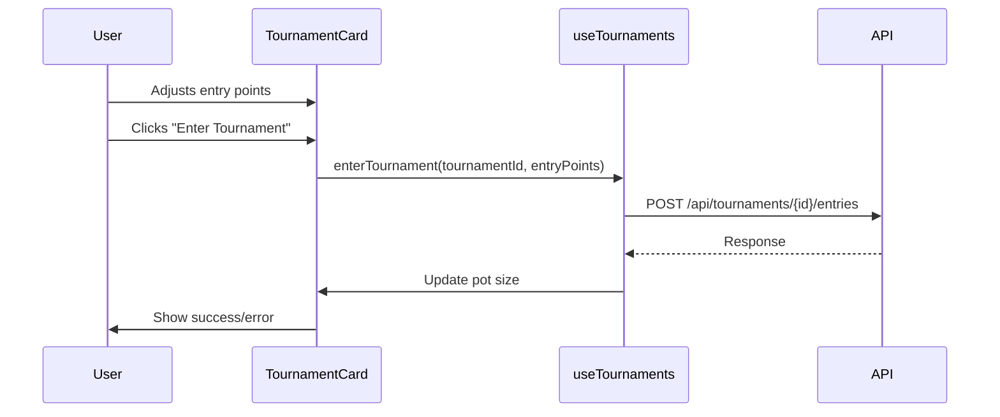

# Frontend Changes Documentation

This document outlines the changes made to the frontend to ensure proper display of entry fees, prize pools, and tournament functionality.

## Changes Made

### Tournament Entry Flow Implementation


#### Key Features:
- Real-time pot size updates every 5 seconds
- Entry point adjustment controls (+25/-25)
- Loading states for entry submission
- Minimum entry validation (tournament.min_entry)
- Error handling with console logging

### Entry Fee Implementation Details
- Added new `FeeDisplay` component with responsive design
- Integrated fee display across 4 contexts:
  - Event cards
  - Prediction modal
  - Event creation form
  - User balance overlay
- Implemented validation workflow:
  ```mermaid
  graph TD
    A[User Initiates Bet] --> B{Entry Fee Valid?}
    B -->|Yes| C[Check Balance]
    B -->|No| D[Show Error]
    C -->|Sufficient| E[Process Bet]
    B -->|No| D[Show Error Message]
    C -->|Sufficient| E[Process Bet]
    C -->|Insufficient| F[Show Balance Warning]
  ```

#### Validation Messaging
- **Insufficient balance**:
  ```javascript
  `Insufficient points. Need ${required} more to enter`
  ```
- **Invalid API response**:
  ```javascript
  'Could not verify balance. Please try again'
  ```

### Responsive Design Implementation
- **Mobile layouts**:
  - Stacked elements
  - Compact fee display (icon + amount)
  - 100% width buttons
- **Desktop layouts**:
  - Inline elements with flex spacing
  - Detailed fee breakdown tooltips
  - Fixed-width containers

### Event Creation Form Updates
- Changed the default entry fee in the event creation form from 250 to 0
- Updated the event creation logic to use the configured entry fee or default to 0
- Made the entry fee configurable in the event creation form

### 2. Display Updates
- Ensured that entry fees are properly displayed in event cards
- Ensured that prize pools are properly displayed in event cards
- Added proper formatting for currency values using `toLocaleString()`

### 3. User Balance Validation
- Updated the user balance validation to use the actual event entry fee instead of hardcoded 250
- Added proper error messaging when users have insufficient points

## Files Modified

### `frontend/src/App.jsx`
- Updated default entry fee from 250 to 0 in the newEvent state initialization
- Updated event creation logic to use configured entry fee or default to 0
- Ensured proper display of entry fees and prize pools in event cards
- Added proper formatting for currency values

## Code Changes

### Event Creation Form Default Value
```javascript
// Before
const [newEvent, setNewEvent] = React.useState({
  // ... other fields
  entry_fee: 250
});

// After
const [newEvent, setNewEvent] = React.useState({
  // ... other fields
  entry_fee: 0
});
```

### Event Creation Logic
```javascript
// Before
entry_fee: parseInt(newEvent.entry_fee) || 250, // Use configured entry fee or default to 250

// After
entry_fee: parseInt(newEvent.entry_fee) || 0, // Use configured entry fee or default to 0
```

### Display Updates
```javascript
// Entry fee display
<span className="icon">🎫</span>
Min. Entry: {event.entry_fee} points

// Prize pool display
<span className="icon">💰</span>
Pot: ${event.prize_pool?.toLocaleString() || 0}
```

## Visual References

### Mobile Layout

- Compact layout with icon and amount
- Full-width validation message

### Desktop Layout

- Detailed breakdown with tooltip
- Side-by-side elements

### Validation States


## Verification

After implementing these changes:
1. Entry fees are properly configurable in the event creation form
2. Entry fees are correctly displayed in event cards
3. Prize pools are correctly displayed in event cards
4. User balance validation uses the actual event entry fee
5. API responses are properly validated
6. Error messages follow consistent styling
7. Currency values are properly formatted

## Testing

To verify the frontend changes:
1. Create a new event with a custom entry fee
2. Verify that the entry fee is displayed correctly in the event card
3. Verify that the prize pool is displayed correctly in the event card
4. Attempt to place a bet with insufficient points to verify error messaging
5. Place a bet with sufficient points to verify the process works correctly

## Tournament Implementation Details

### Component Structure
```javascript
TournamentCard.jsx
├── useEffect (pot size polling)
├── handleEntry (submission handler)
├── Entry controls UI
│   ├── Point adjustment buttons
│   ├── Input field
│   └── Submit button
└── Pot display
    ├── Current pot size
    └── Loading state

useTournaments.js
├── enterTournament()
└── getPotSize()
```

### Key Props
```javascript
TournamentCard.propTypes = {
  tournament: PropTypes.shape({
    id: PropTypes.string.isRequired,
    min_entry: PropTypes.number.isRequired,
    pot_size: PropTypes.number.isRequired,
    participants_count: PropTypes.number.isRequired,
    status: PropTypes.string.isRequired
  })
};
```

### Error Handling
```javascript
const handleEntry = async () => {
  try {
    await enterTournament(tournament.id, entryPoints);
    const newPot = await getPotSize(tournament.id);
    setPotSize(newPot);
  } catch (error) {
    console.error('Entry failed:', error);
  }
};
```

### Real-time Updates
```javascript
React.useEffect(() => {
  const fetchPot = async () => {
    const updatedPot = await getPotSize(tournament.id);
    setPotSize(updatedPot);
  };
  const interval = setInterval(fetchPot, 5000);
  return () => clearInterval(interval);
}, [tournament.id]);
```
