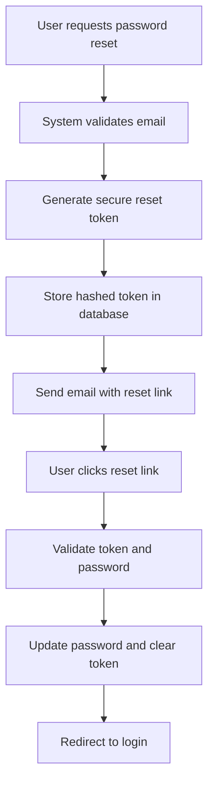

# Password Reset Flow

## Overview

The Password Reset Flow provides a secure mechanism for users to reset their passwords when they forget them. The system implements industry-standard security practices including token-based authentication, rate limiting, and email enumeration protection.



## API Endpoints

### POST `/api/auth/forgot-password`

Initiates the password reset process by sending a reset link to the user's email.

**Request:**
```json
{
  "email": "user@example.com"
}
```

**Response:**
```json
{
  "message": "If an account with that email exists, a password reset link has been sent"
}
```

**Parameters and Validation:**
- `email` (required): Must be a valid email format (`/^[^\s@]+@[^\s@]+\.[^\s@]+$/`)
- Returns HTTP 400 for invalid email format
- Returns HTTP 200 regardless of whether email exists (security best practice)

**Error Codes:**
- `400 Bad Request`: Invalid email format
- `429 Too Many Requests`: Rate limit exceeded (10 requests per minute)

### POST `/api/auth/reset-password`

Completes the password reset process using the token from the reset link.

**Request:**
```json
{
  "token": "abc123def456...",
  "newPassword": "NewSecurePassword123!",
  "confirmPassword": "NewSecurePassword123!"
}
```

**Response:**
```json
{
  "message": "Password successfully reset"
}
```

**Parameters and Validation:**
- `token` (required): Reset token from email link
- `newPassword` (required): Must meet complexity requirements:
  - Minimum 8 characters
  - At least one uppercase letter
  - At least one lowercase letter  
  - At least one number
  - At least one special character (`!@#$%^&*()_+\-=\[\]{};':"\\|,.<>\/?`)
- `confirmPassword` (required): Must match `newPassword`

**Error Codes:**
- `400 Bad Request`: Invalid token, password mismatch, or weak password
- `404 Not Found`: User not found for token

## Frontend Components

### ForgotPasswordForm

The [`ForgotPasswordForm`](../frontend/src/components/ForgotPasswordForm.jsx) component handles the initial password reset request.

**Features:**
- Email validation with real-time error feedback
- Loading states during submission
- Success message display
- Automatic form clearing after successful submission
- Accessibility support with ARIA attributes

**Props:**
- `onClose`: Function to close the modal (optional)

### ResetPasswordForm

The [`ResetPasswordForm`](../frontend/src/components/ResetPasswordForm.jsx) component handles the actual password reset.

**Features:**
- Password strength validation with detailed requirements
- Password visibility toggle
- Token extraction from URL parameters
- Automatic redirect to login after successful reset
- Comprehensive error handling

**Props:**
- `onClose`: Function to close the modal (optional)

## Database Changes

The password reset functionality required adding two new columns to the `users` table:

### Migration: [`20251106190300_add_password_reset_columns.js`](../backend/migrations/20251106190300_add_password_reset_columns.js)

**Added Columns:**
- `password_reset_token` (TEXT): Stores the hashed reset token using bcrypt
- `password_reset_expires` (TIMESTAMP): Token expiration timestamp (1 hour)

**Indexes Created:**
- `idx_users_password_reset_token`: Optimizes token lookup
- `idx_users_password_reset_expires`: Optimizes expired token cleanup

**Database Support:**
- PostgreSQL: Full ALTER TABLE support with IF NOT EXISTS
- SQLite: Error handling for duplicate columns with try-catch

## Security Features

### Rate Limiting
- **Configuration**: 10 requests per minute for `/api/auth/forgot-password`
- **Purpose**: Prevents brute force attacks and email bombing
- **Implementation**: Uses [`express-rate-limit`](https://www.npmjs.com/package/express-rate-limit)

### Email Enumeration Protection
- **Strategy**: Returns identical success messages regardless of email existence
- **Timing**: Adds random 50-150ms delay to prevent timing attacks
- **Response**: Uniform "If an account with that email exists..." message

### Token Security
- **Generation**: 32-byte cryptographically secure random tokens
- **Storage**: Tokens are hashed using bcrypt (10 rounds) before storage
- **Expiration**: Tokens expire after 1 hour
- **Validation**: Uses `bcrypt.compare()` for secure token verification

### Password Requirements
- **Complexity**: Requires uppercase, lowercase, number, and special character
- **Length**: Minimum 8 characters
- **Validation**: Server-side validation with detailed error messages

## Testing

### Test Files
- [`test_password_reset.js`](../backend/test_password_reset.js): Basic endpoint testing
- [`comprehensive_password_reset_test.js`](../backend/comprehensive_password_reset_test.js): Comprehensive test suite

### Test Coverage
- ✅ Basic functionality testing
- ✅ Rate limiting validation  
- ✅ Email enumeration protection
- ✅ Password validation rules
- ✅ Token expiration handling
- ✅ Error handling scenarios

### Test Results
```bash
# Sample test output
📊 TEST SUMMARY
===============
Total Tests: 15
Passed: 15
Failed: 0
Success Rate: 100.0%

🎉 All tests passed!
```

## Usage Examples

### Example 1: Requesting Password Reset

**Frontend Implementation:**
```javascript
const handleForgotPassword = async (email) => {
  try {
    const response = await fetch('/api/auth/forgot-password', {
      method: 'POST',
      headers: { 'Content-Type': 'application/json' },
      body: JSON.stringify({ email })
    });
    
    if (response.ok) {
      // Show success message
      alert('If an account with that email exists, a reset link has been sent');
    } else {
      throw new Error('Failed to send reset email');
    }
  } catch (error) {
    console.error('Password reset request failed:', error);
  }
};
```

### Example 2: Completing Password Reset

**Frontend Implementation:**
```javascript
const handleResetPassword = async (token, newPassword, confirmPassword) => {
  try {
    const response = await fetch('/api/auth/reset-password', {
      method: 'POST',
      headers: { 'Content-Type': 'application/json' },
      body: JSON.stringify({ token, newPassword, confirmPassword })
    });
    
    if (response.ok) {
      // Redirect to login after successful reset
      window.location.href = '/login?message=password_reset_success';
    } else {
      const errorData = await response.json();
      throw new Error(errorData.error || 'Password reset failed');
    }
  } catch (error) {
    console.error('Password reset failed:', error);
  }
};
```

### Example 3: Backend Token Handling

**Server Implementation:**
```javascript
// Token generation and storage
const resetToken = crypto.randomBytes(32).toString('hex');
const hashedToken = await bcrypt.hash(resetToken, 10);
const expiresAt = new Date();
expiresAt.setHours(expiresAt.getHours() + 1);

await db.raw(`
  UPDATE users 
  SET password_reset_token = ?, password_reset_expires = ?
  WHERE email = ?
`, [hashedToken, expiresAt, email]);
```

## Integration with Email Service

The system uses the existing [`emailUtils.js`](../backend/utils/emailUtils.js) pattern:

```javascript
// Development mode - logs to console
console.log('=== PASSWORD RESET EMAIL (DEV MODE) ===');
console.log(`To: ${email}`);
console.log(`Subject: Password Reset Request`);
console.log(`Reset Link: ${resetLink}`);
console.log('=======================================');

// Production integration ready for:
// - Nodemailer with SMTP
// - SendGrid API  
// - AWS SES
// - Mailgun
```

## Environment Variables

**Required for Production:**
```env
FRONTEND_BASE_URL=https://your-app.vercel.app
EMAIL_FROM=noreply@yourdomain.com
```

**Optional for Development:**
```env
# Disable rate limiting for testing
NODE_ENV=test
```

## Troubleshooting

### Common Issues

1. **Emails not sending in production**
   - Check email service configuration
   - Verify `FRONTEND_BASE_URL` is set correctly
   - Ensure email service API keys are configured

2. **Tokens not working**
   - Verify token expiration (1 hour)
   - Check database connection for token storage
   - Ensure bcrypt is working correctly

3. **Rate limiting too restrictive**
   - Adjust `passwordResetLimiter` configuration in [`server.js`](../backend/server.js)
   - Use `NODE_ENV=test` to disable rate limiting for testing

### Debug Mode

Enable debug logging by checking server console for:
- Password reset request logs
- Token generation details
- Email simulation output
- Rate limiting events

## Future Enhancements

- [ ] Implement actual email service integration
- [ ] Add password reset attempt logging
- [ ] Implement account lockout after multiple failed attempts  
- [ ] Add CAPTCHA protection for reset requests
- [ ] Support for multiple reset tokens per user
- [ ] Mobile app deep linking support