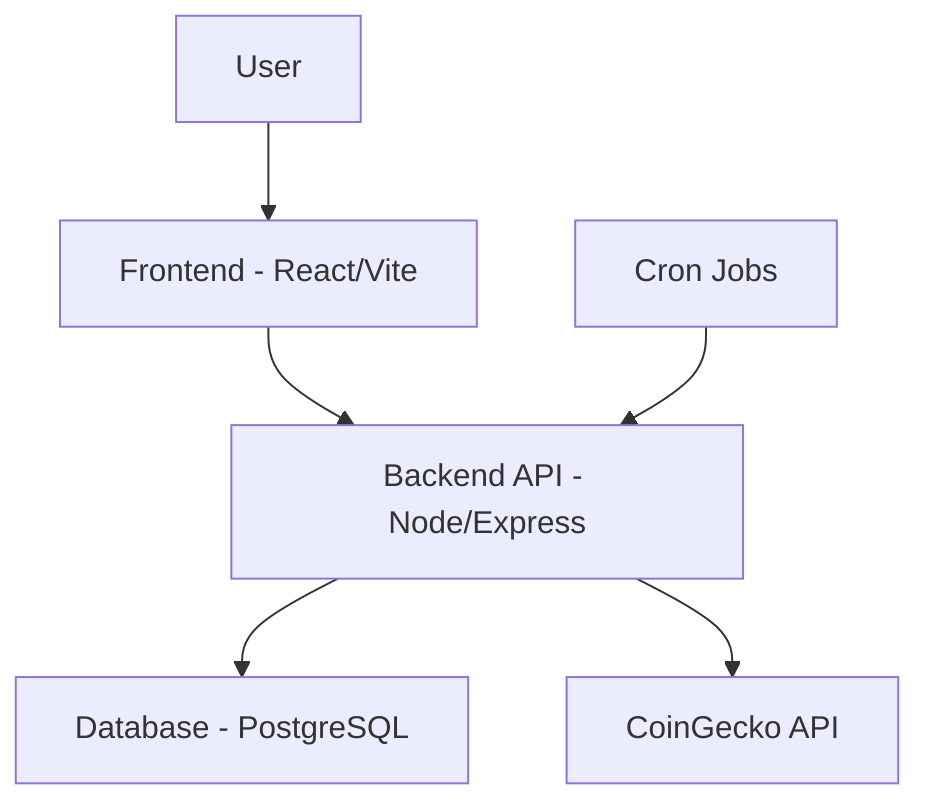
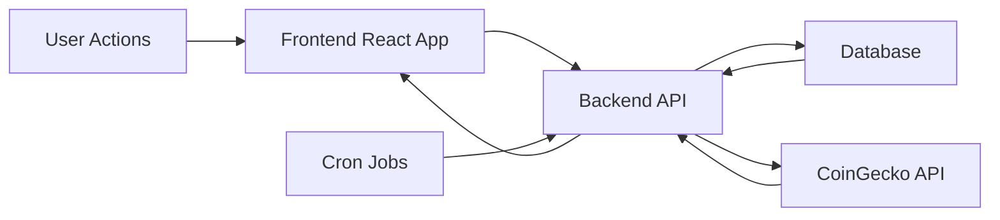

# Polycentral Predictions - Project Context Guide

## Project Overview

This document serves as a comprehensive context guide for the Polycentral Predictions application, providing essential information for any AI or persona seeking to understand the project's purpose, architecture, and functionality.

## Project Purpose and Goals

### Core Purpose
Polycentral Events is a unified event management platform that allows users to participate in various time-based competitions. The application combines tournament-style engagements with adaptive entry systems, providing a flexible framework for different event types.

### Primary Goals
1. **Educational Engagement**: Help users understand cryptocurrency market volatility through interactive participation
2. **Gamification**: Create a rewarding system that encourages regular engagement with market data
3. **Community Building**: Foster a community of cryptocurrency enthusiasts and predictors
4. **Data Visualization**: Present complex financial data in an accessible and engaging format
5. **Skill Development**: Help users develop better market analysis and prediction skills

### Target Audience
- Cryptocurrency enthusiasts
- Financial market hobbyists
- Gamification platform users
- Individuals interested in learning about market dynamics
- Community-driven prediction game participants

## Core Features and Functionality

### User Management System
- **Registration and Authentication**: Secure user account creation with email verification
- **Points Economy**: Starting balance of 1000 points with daily 250-point claims
- **Profile Management**: User profiles with prediction history and performance tracking
- **Session Management**: JWT-based authentication with secure token handling

### Prediction System
- **Daily Events**: Automated creation of 24-hour Bitcoin prediction events
- **Binary Predictions**: Simple "Higher" or "Lower" prediction choices
- **Points-Based Entry**: 250 points required to participate in each event
- **Prize Pools**: Shared winnings from all participants in successful predictions
- **Automated Resolution**: Hourly checking and resolution of expired events
- **Result Distribution**: Automatic points distribution to winners

### Event Management
- **Event Creation**: Daily automated events with current Bitcoin price baseline
- **Event Tracking**: Real-time display of active events and participant counts
- **Time Management**: 24-hour prediction windows with countdown timers
- **Status Monitoring**: Active, expired, and resolved event status tracking
- **Historical Data**: Access to past event results and user participation

### User Interface
- **Responsive Design**: Works on desktop, tablet, and mobile devices
- **Modern Aesthetics**: Aero/Glassmorphism design system with dark theme
- **Interactive Elements**: Visual feedback for user actions and predictions
- **Data Visualization**: Price charts and trend indicators
- **Real-time Updates**: Dynamic UI updates for events and user status

## Technical Architecture

### System Architecture
The application follows a modern microservice architecture with separate frontend and backend services, connected through a REST API.

### Backend Architecture
- **Runtime**: Node.js with Express framework
- **Database**: PostgreSQL (production) with SQLite support (development)
- **Authentication**: JWT tokens with bcrypt password hashing
- **API Integration**: RESTful communication with CoinGecko API
- **Task Scheduling**: Node-cron for automated operations
- **Security**: Helmet, CORS, and rate limiting middleware
- **Database Migrations**: Versioned schema management system

### Frontend Architecture
- **Framework**: React with Vite build tool
- **Routing**: React Router for client-side navigation
- **State Management**: React's built-in state management
- **Styling**: CSS with custom design system
- **API Communication**: Axios for HTTP requests
- **UI Components**: Modular component structure

### Deployment Architecture
- **Frontend**: Vercel hosting with automatic deployments
- **Backend**: Railway hosting with environment-based configuration
- **Database**: Railway PostgreSQL database
- **Environment**: Separate configurations for development and production
- **CI/CD**: GitHub integration with automatic deployment

### Database Design
- **Users Table**: User accounts, authentication, and points management
- **Events Table**: Prediction events with timing and status tracking
- **Participants Table**: User predictions and participation records
- **Event Types Table**: Classification of different event types
- **Schema Migrations**: Versioned database schema changes
- **Data Integrity**: Foreign key constraints and validation

### API Structure
- **RESTful Design**: Standard HTTP methods and status codes
- **Authentication**: JWT-based protected endpoints
- **Rate Limiting**: Request throttling to prevent abuse
- **Error Handling**: Comprehensive error responses
- **Data Validation**: Input validation and sanitization
- **Documentation**: Self-documenting endpoint structure

## User Experience and Interface

### User Interface Design Philosophy
The application follows a modern Aero/Glassmorphism design system with a dark theme that reduces eye strain and provides visual contrast for data visualization. The interface prioritizes clarity and ease of use while maintaining an engaging aesthetic.

### Key UI Components

#### Authentication Interface
- **Registration Form**: Clean modal with real-time validation
- **Login Form**: Simple email/password entry with password visibility toggle
- **Form Validation**: Immediate feedback for input errors
- **Loading States**: Visual indicators during form submission

#### Navigation System
- **Top Navigation Bar**: Consistent navigation across all pages
- **User Status Panel**: Points balance and daily claim button
- **Tab Navigation**: Clear separation between events and predictions
- **Responsive Menu**: Adapts to different screen sizes

#### Event Display
- **Card-Based Layout**: Attractive event cards with key information
- **Visual Status Indicators**: Color-coded status badges
- **Time Remaining Display**: Prominent countdown timers
- **Prize Pool Visualization**: Clear display of potential winnings
- **Sentiment Indicators**: Visual representation of user predictions

#### Prediction Interface
- **Detailed Event View**: Modal with comprehensive event information
- **Price Visualization**: Charts showing price trends
- **Binary Choice Buttons**: Large, clear "Higher"/"Lower" options
- **Confirmation Feedback**: Success/error messages for predictions
- **Balance Integration**: Points display integrated with prediction actions

#### User Dashboard
- **Points Management**: Central display of current balance
- **Daily Claim Feature**: Prominent button for free points
- **Prediction History**: Access to past predictions and results
- **Performance Tracking**: Win/loss statistics and trends

### User Experience Features

#### Interactive Elements
- **Smooth Animations**: Transitions between states and views
- **Visual Feedback**: Button presses and hover effects
- **Toast Notifications**: Non-intrusive status updates
- **Loading Indicators**: Progress feedback for asynchronous operations
- **Error Handling**: Clear error messages with resolution guidance

#### Accessibility
- **Keyboard Navigation**: Full keyboard support for all interactions
- **Screen Reader Compatibility**: Proper ARIA attributes
- **Contrast Compliance**: WCAG-compliant color contrast
- **Focus Management**: Clear focus indicators for interactive elements
- **Responsive Design**: Adapts to different screen sizes and orientations

#### Performance Optimization
- **Efficient Rendering**: React component optimization
- **Lazy Loading**: Components loaded only when needed
- **Caching**: Strategic data caching to reduce API calls
- **Bundle Optimization**: Minified and compressed assets
- **Progressive Enhancement**: Core functionality works without JavaScript

### User Flow

#### New User Journey
1. **Landing Page**: Introduction to the application
2. **Registration**: Account creation with validation
3. **Onboarding**: Brief introduction to features
4. **First Prediction**: Guided first event participation
5. **Engagement**: Regular participation and points management

#### Returning User Journey
1. **Login**: Quick access to account
2. **Dashboard Review**: Points balance and available events
3. **Event Participation**: Browse and predict on events
4. **History Check**: Review past predictions and results
5. **Daily Claim**: Collect free points

#### Administrative Actions
1. **Event Management**: Create or resolve events (admin only)
2. **System Monitoring**: Check system health and status
3. **Data Analysis**: Review participation and performance metrics
4. **User Support**: Handle user issues and inquiries

## Data Flow and Integration

### Data Flow Architecture

The application follows a unidirectional data flow pattern with the frontend consuming data from the backend API, which in turn interacts with the database and external services.

### Core Data Entities

#### User Data
- **Profile Information**: Username, email, registration date
- **Authentication Data**: Password hash, JWT tokens
- **Points Balance**: Current points, last claim date
- **Activity Tracking**: Last login, participation history
- **Prediction History**: Past predictions and results

#### Event Data
- **Event Details**: Title, description, timing
- **Price Information**: Initial price, final price
- **Status Tracking**: Active, expired, resolved
- **Participation Data**: Participant count, prize pool
- **Outcome Data**: Correct answer, resolution status

#### Prediction Data
- **User Reference**: Link to user who made prediction
- **Event Reference**: Link to event being predicted
- **Prediction Choice**: "Higher" or "Lower" selection
- **Points Wagered**: Amount of points used for prediction
- **Timestamp**: When prediction was made

### Data Integration Points

#### CoinGecko API Integration
- **Current Price Retrieval**: For event creation
- **Historical Price Retrieval**: For event resolution
- **Rate Limiting**: Exponential backoff for API requests
- **Error Handling**: Graceful degradation on API failures
- **Data Validation**: Ensuring price data integrity

#### Database Integration
- **Connection Management**: Pooling for PostgreSQL, direct for SQLite
- **Transaction Safety**: ACID compliance for critical operations
- **Query Optimization**: Indexing and efficient query patterns
- **Migration System**: Versioned schema changes
- **Data Consistency**: Constraints and validation

#### Authentication Integration
- **Token Management**: JWT generation and validation
- **Password Security**: Bcrypt hashing and verification
- **Session Tracking**: User state management
- **Rate Limiting**: Protection against authentication attacks
- **Audit Logging**: Authentication events tracking

### Data Processing Workflows

#### Event Creation Workflow
1. **Trigger**: Daily cron job or manual admin action
2. **Data Retrieval**: Fetch current Bitcoin price from CoinGecko
3. **Data Processing**: Format event details and parameters
4. **Database Storage**: Insert new event record
5. **Validation**: Ensure no duplicate events
6. **Notification**: Log successful creation

#### Prediction Workflow
1. **User Action**: User selects prediction option
2. **Validation**: Check user balance and event status
3. **Data Processing**: Prepare prediction record
4. **Transaction**: Deduct points and record prediction
5. **Database Update**: Update event statistics
6. **User Feedback**: Confirm prediction success

#### Resolution Workflow
1. **Trigger**: Hourly cron job
2. **Data Retrieval**: Find expired events
3. **Price Retrieval**: Get historical prices from CoinGecko
4. **Outcome Calculation**: Determine correct predictions
5. **Payout Processing**: Calculate and distribute winnings
6. **Status Update**: Mark events as resolved
7. **Notification**: Log resolution completion

#### User Management Workflow
1. **Registration**: Validate input, hash password, create user
2. **Login**: Verify credentials, generate token
3. **Points Management**: Track claims and usage
4. **History Tracking**: Record participation and results
5. **Session Management**: Handle login/logout events

### Data Security and Privacy

#### Data Protection
- **Encryption**: Passwords hashed with bcrypt
- **Tokenization**: JWT tokens for session management
- **Input Validation**: Sanitization of all user inputs
- **Access Control**: Role-based endpoint protection
- **Audit Trails**: Logging of critical data operations

#### Privacy Considerations
- **Minimal Data Collection**: Only necessary user information
- **Data Retention**: Clear policies for data storage
- **User Control**: Ability to view and manage data
- **Compliance**: GDPR and privacy regulation adherence
- **Secure Storage**: Encrypted database storage

#### Data Integrity
- **Constraints**: Database-level data validation
- **Transactions**: Atomic operations for data consistency
- **Backup**: Regular database backups
- **Recovery**: Point-in-time recovery procedures
- **Monitoring**: Data quality and consistency checks

## Key Technical Details

### Technology Stack

#### Frontend Technologies
- **React**: Component-based UI library
- **Vite**: Fast build tool and development server
- **React Router**: Client-side routing
- **Axios**: HTTP client for API requests
- **CSS**: Custom styling with modern design system

#### Backend Technologies
- **Node.js**: JavaScript runtime environment
- **Express**: Web application framework
- **PostgreSQL**: Production database
- **SQLite**: Development database
- **JWT**: JSON Web Token for authentication
- **Bcrypt**: Password hashing library
- **Node-cron**: Task scheduling

#### Development and Deployment Tools
- **Vercel**: Frontend deployment platform
- **Railway**: Backend deployment platform
- **Docker**: Containerization support
- **GitHub**: Version control and CI/CD
- **Nodemon**: Development server with hot reloading

### API Endpoints

#### Authentication Endpoints
- **POST /api/auth/register**: User registration
- **POST /api/auth/login**: User authentication

#### User Management Endpoints
- **POST /api/user/claim-free-points**: Daily points claim
- **GET /api/user/history**: User prediction history

#### Event Endpoints
- **GET /api/events/active**: List active events
- **POST /api/events**: Create new event
- **GET /api/events/:id**: Get event details
- **POST /api/events/:id/bet**: Place prediction
- **POST /api/events/resolve**: Manual event resolution
- **POST /api/admin/events/create**: Manual event creation

#### Utility Endpoints
- **GET /api/health**: System health check
- **GET /api/debug/participants-schema**: Database schema debugging

### Database Schema

#### Users Table
- **id**: Primary key
- **email**: Unique email address
- **username**: Unique display name
- **password_hash**: Bcrypt hashed password
- **points**: Points balance (default 1000)
- **last_claim_date**: Last free points claim
- **last_login_date**: Last login timestamp
- **created_at**: Account creation timestamp

#### Events Table
- **id**: Primary key
- **title**: Unique event title
- **description**: Event description
- **entry_fee**: Points required to participate
- **initial_price**: Starting cryptocurrency price
- **final_price**: Ending cryptocurrency price
- **start_time**: Event start timestamp
- **end_time**: Event end timestamp
- **status**: Event status
- **resolution_status**: Resolution status
- **crypto_symbol**: Cryptocurrency symbol
- **created_at**: Event creation timestamp

#### Participants Table
- **id**: Primary key
- **event_id**: Foreign key to events
- **user_id**: Foreign key to users
- **prediction**: "Higher" or "Lower" prediction
- **amount**: Points wagered
- **created_at**: Participation timestamp

### Environment Configuration

#### Key Environment Variables
- **NODE_ENV**: Environment identifier (development/production)
- **PORT**: Server port number
- **DATABASE_URL**: PostgreSQL connection string
- **JWT_SECRET**: Secret for JWT token signing
- **ADMIN_API_KEY**: Key for admin endpoints
- **COINGECKO_API_KEY**: CoinGecko API access key
- **CRYPTO_ID**: Cryptocurrency identifier
- **CORS_ORIGIN**: Allowed frontend origins

#### Configuration Management
- **Environment Detection**: Automatic production/development detection
- **Database Selection**: PostgreSQL for production, SQLite for development
- **Security Settings**: Different security levels for environments
- **Logging Levels**: Verbose in development, minimal in production

### Security Implementation

#### Authentication Security
- **Password Hashing**: Bcrypt with 12 salt rounds
- **Token Expiration**: 7-day JWT token expiration
- **Rate Limiting**: 100 requests per 15 minutes
- **Input Validation**: Sanitization of all user inputs
- **Session Management**: Secure token storage

#### Data Security
- **HTTPS**: Encrypted communication
- **CORS**: Controlled cross-origin requests
- **SQL Injection**: Parameterized queries
- **XSS Protection**: Output encoding
- **CSRF Protection**: Token-based validation

#### API Security
- **Authentication Middleware**: JWT validation
- **Admin Protection**: Separate API key for admin functions
- **Error Handling**: Non-disclosure of sensitive information
- **Request Validation**: Schema validation for all inputs
- **Access Control**: Role-based endpoint access

### Performance Optimization

#### Frontend Optimization
- **Code Splitting**: Route-based component loading
- **Asset Compression**: Minified CSS and JavaScript
- **Caching**: Strategic data caching
- **Lazy Loading**: Components loaded on demand
- **Bundle Optimization**: Tree shaking and dead code elimination

#### Backend Optimization
- **Database Connection Pooling**: Efficient database connections
- **Query Optimization**: Indexed queries and efficient patterns
- **Caching**: API response caching
- **Compression**: Gzip compression for responses
- **Load Balancing**: Horizontal scaling support

#### Database Optimization
- **Indexing**: Strategic indexes for common queries
- **Query Planning**: Optimized query execution
- **Connection Management**: Efficient connection pooling
- **Data Archiving**: Historical data management
- **Performance Monitoring**: Query performance tracking

### Monitoring and Logging

#### Application Logging
- **Structured Logging**: Consistent log format
- **Error Tracking**: Detailed error information
- **Performance Metrics**: Request timing and resource usage
- **Audit Trails**: User actions and system events
- **Debug Information**: Development-friendly logging

#### Health Monitoring
- **API Health**: Endpoint availability checking
- **Database Health**: Connection and query performance
- **External Service**: CoinGecko API availability
- **Resource Usage**: Memory and CPU monitoring
- **Error Rates**: Application error tracking

#### Deployment Monitoring
- **Uptime Monitoring**: Service availability
- **Performance Metrics**: Response times and throughput
- **Error Tracking**: Production error reporting
- **Resource Monitoring**: System resource usage
- **Alerting**: Notification for critical issues

## Project Context Guide Summary

This comprehensive context guide provides all essential information about the Polycentral Predictions application for any AI or persona seeking to understand the project. The application is a cryptocurrency prediction platform that combines financial market engagement with a gamified points system.

### Key Project Aspects

1. **Purpose**: Educational engagement with cryptocurrency markets through gamified predictions
2. **Core Functionality**: Daily Bitcoin price prediction events with points-based participation
3. **Technical Architecture**: Modern microservice design with React frontend and Node/Express backend
4. **User Experience**: Aero/Glassmorphism design with responsive, interactive interface
5. **Data Flow**: Unidirectional flow with CoinGecko API integration and PostgreSQL database
6. **Security**: JWT authentication, bcrypt password hashing, and comprehensive validation
7. **Deployment**: Vercel (frontend) and Railway (backend) with CI/CD integration

### Unique Features
- Automated daily event creation and resolution
- Real-time cryptocurrency data from CoinGecko API
- Points-based economy with daily rewards
- Binary prediction system (Higher/Lower)
- Prize pool distribution to winners
- Comprehensive user history tracking

### Technical Highlights
- RESTful API design with consistent endpoints
- Database schema with migration support
- Environment-based configuration management
- Performance optimization for both frontend and backend
- Comprehensive error handling and logging
- Security-first implementation with multiple protection layers

### Target Context Users
This guide is designed for:
- AI systems requiring project context
- New developers joining the project
- Product managers and stakeholders
- Technical documentation writers
- Support personnel
- System administrators

The information is structured to provide both high-level understanding and technical details, making it accessible to different audiences while maintaining technical accuracy.