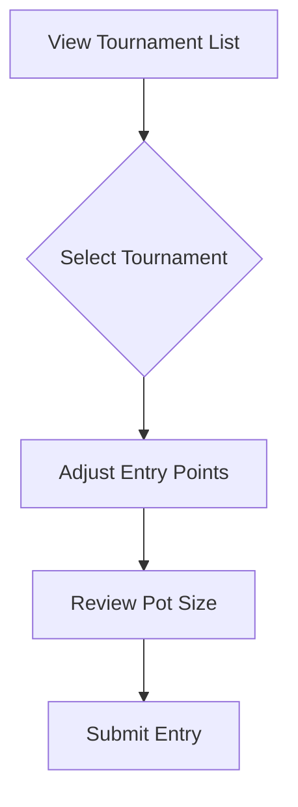

# Tournament Participation Guide

## Getting Started with Tournaments


### Making an Entry
1. Use +/-25 buttons to adjust entry points
2. Ensure points meet minimum requirement (red border indicates invalid)
3. Click "Enter Tournament"


## Key Features
- Real-time pot updates every 5 seconds
- Multi-entry support (submit multiple entries)
- Historical performance tracking

## Tournament Rules
| Rule Type | Requirement |
|-----------|-------------|
| Minimum Entry | 100 points |
| Entry Increment | 25 points |
| Max Entries | 10 per tournament |

## Troubleshooting
- **Insufficient Points**: 
  - Claim daily free points
  - Participate in prediction events
- **Entry Failed**:
  ```javascript
  try {
    await enterTournament(id, points);
  } catch (error) {
    console.error('Entry failed:', error);
    // Show user-friendly error message
  }