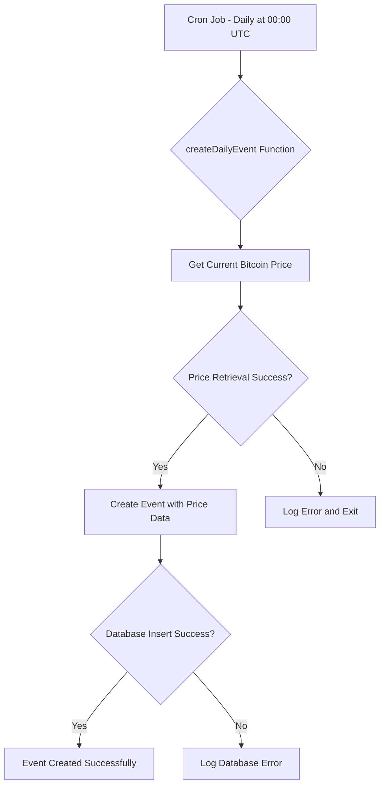

# Investigation: No Events Created in Last 24 Hours

## Issue Summary
User reports that no events were created during the last 24 hours. The system should automatically create daily Bitcoin prediction events at midnight UTC.

## Current Setup Analysis

### Cron Schedule
- Daily event creation: `0 0 * * *` (midnight UTC every day)
- Current time: 2025-10-13T16:09:17.273Z (UTC)
- Last scheduled run should have been today at 00:00 UTC (approximately 16 hours ago)

### Event Creation Process
1. `createDailyEvent()` function is scheduled to run daily at midnight UTC
2. Function calls `coingecko.getCurrentPrice('bitcoin')` to get current price
3. Calls `createEvent(price)` to create a new event with:
   - 24-hour duration
   - Price range options based on current price
   - Entry fee of 100 points

### Database Configuration
- Using PostgreSQL in production: `DB_TYPE=postgres`
- Database connection string provided in `.env` file

## Potential Issues to Investigate

### 1. CoinGecko API Integration
- API key validity
- API rate limiting
- Network connectivity issues
- Error handling in coingecko.js

### 2. Database Issues
- Connection failures
- Schema problems
- Constraint violations
- Transaction rollbacks

### 3. Cron Job Execution
- Cron job not running at all
- Cron job running but failing silently
- Timezone configuration issues

### 4. Application Startup
- Server not running long enough to trigger cron
- Initialization errors preventing cron setup

## Investigation Steps

### Step 1: Check Terminal Logs
- Look for any error messages related to event creation
- Check for CoinGecko API errors
- Look for database connection issues

### Step 2: Verify CoinGecko API Access
- Test API key validity
- Check if getCurrentPrice function works
- Verify network connectivity to CoinGecko

### Step 3: Query Database for Recent Events
- Check if any events were created recently
- Look for events with start_time in last 48 hours
- Check for any error logs in database

### Step 4: Manual Test of Event Creation
- Use admin endpoint to manually trigger event creation
- Check if manual creation works

## Recommended Actions

### Immediate Actions
1. Check terminal logs for error messages
2. Verify CoinGecko API key is valid
3. Query database for recent events

### Short-term Fixes
1. If CoinGecko API is the issue, implement better error handling
2. If database is the issue, fix schema or connection problems
3. Add more detailed logging to event creation process

### Long-term Improvements
1. Add monitoring for cron job execution
2. Implement alerting for failed event creation
3. Add retry mechanism for failed event creation
4. Create a dashboard to monitor event creation status

## Mermaid Diagram: Event Creation Workflow



## Mermaid Diagram: Event Resolution Workflow

```mermaid
graph TD
    J[Cron Job - Hourly at :00] --> K{resolvePendingEvents Function}
    K --> L[Find Events Ready for Resolution]
    L --> M{Any Events Found?}
    M -->|Yes| N[Get Final Bitcoin Price]
    M -->|No| O[No Events to Resolve]
    N --> P[Update Event with Final Price]
    P --> Q[Determine Correct Answer]
    Q --> R[Calculate Prize Distribution]
    R --> S[Distribute Points to Winners]
    S --> T[Update User Points]
    T --> U[Log Resolution Details]